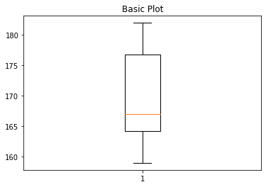

# AI
getstart

sign in github/gmail

open Colaboratory

open file>notebook>choice github>http:xxx>

open file>Save a copy in Github

```
import numpy as np
import pandas as pd # 引用套件並縮寫為 pd  
https://oranwind.org/python-pandas-ji-chu-jiao-xue/
```

# plt


```
import matplotlib.pyplot as plt
 
x  = [1, 2, 3, 4, 5, 6, 7, 8, 9, 10]
y1 = [1, 3, 5, 3, 1, 3, 5, 3, 1, 5]
y2 = [2, 4, 6, 4, 2, 4, 6, 4, 2, 9]
plt.plot(x, y1, 'g', linewidth=5, label="line L")
plt.plot(x, y2, 'r--', label="line H")
plt.plot()

plt.xlabel("x axis")
plt.ylabel("y axis")
plt.title("Line")
plt.legend()
plt.show()
```
函數 https://matplotlib.org/2.1.2/api/_as_gen/matplotlib.pyplot.plot.html

# boxplot
API:
matplotlib.pyplot.boxplot(x, notch=None, sym=None, vert=None, whis=None, positions=None, widths=None, patch_artist=None, bootstrap=None, usermedians=None, conf_intervals=None, meanline=None, showmeans=None, showcaps=None, showbox=None, showfliers=None, boxprops=None, labels=None, flierprops=None, medianprops=None, meanprops=None, capprops=None, whiskerprops=None, manage_ticks=True, autorange=False, zorder=None, *, data=None)
https://matplotlib.org/3.1.3/api/_as_gen/matplotlib.pyplot.boxplot.html
```
import numpy as np
import matplotlib.pyplot as plt

deta = [178 ,  164,  159,  162,  182, 179   ,166  ,168  ,173  ,165]


newDeta = sorted(deta)

mAX = np.max(deta)
mIn = np.min((deta))
med = np.median(deta)


fig1, ax1 = plt.subplots()
ax1.set_title('Basic Plot')
ax1.boxplot(newDeta)
plt.show()
```

